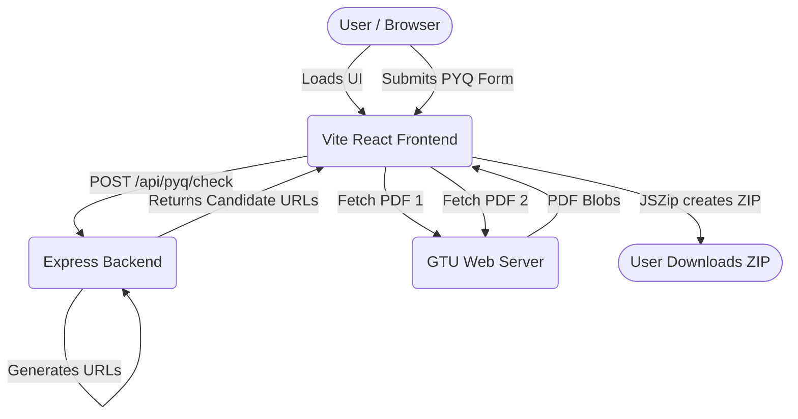

# System Architecture

The GTU PYQ Downloader is a simplified, modern JavaScript application divided into two distinct parts: a **React Frontend** and an **Express Backend**.

## High-Level Diagram

## Architecture Principles

1. **Decoupled Architecture**: 
   The frontend and backend live in completely separate directories (`/frontend` and `/backend`). They run on different ports and are connected only by the `/api/` network boundary.
   
2. **Client-Side Heavy Lifting (Edge Compute)**: 
   The backend does *not* download PDFs or generate ZIP files. This prevents the backend server from running out of bandwidth or memory. Instead, the backend purely acts as a logic-engine to compute URL permutations. The frontend browser does the heavy lifting of fetching PDFs from GTU and zipping them locally using `JSZip`.

3. **Stateless Backend**:
   The backend does not use a database (`lib/db` was removed). It doesn't save user sessions or generated papers. Every request is isolated.

4. **Pure JavaScript**:
   TypeScript has been removed. The application relies entirely on modern JavaScript (ES Modules, JSX, `fetch`) and leverages JSDoc for lightweight developer intelligence without compile steps.
