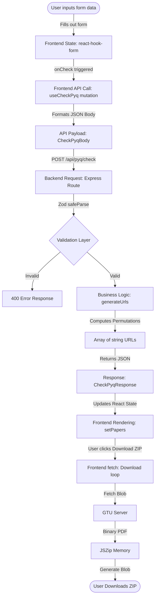
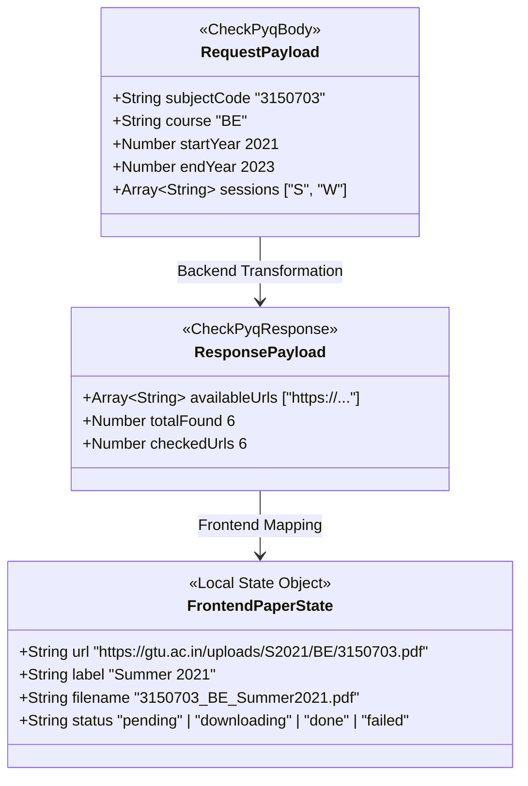
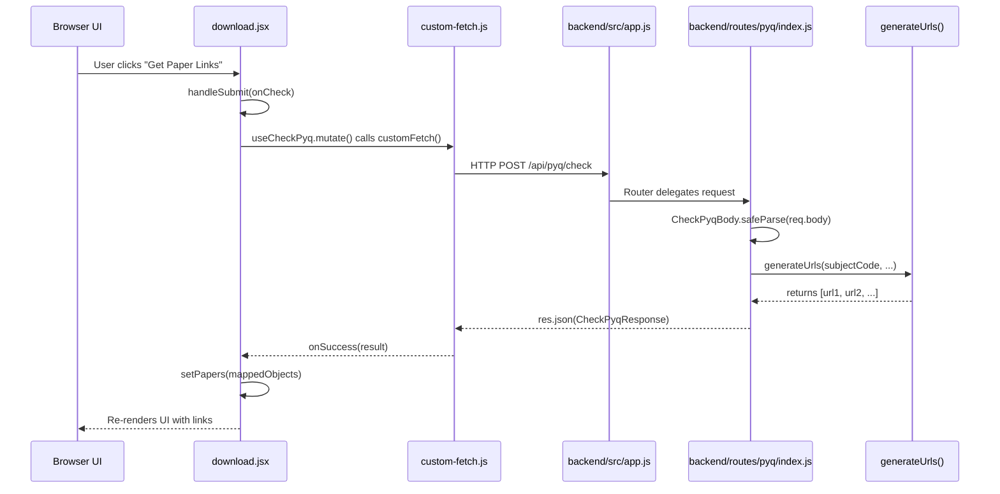

# Code Trace Maps

This document contains execution-level trace maps for the GTU PYQ Downloader application. It is designed to help you trace exactly how variables, objects, and functions move through the system without having to read every line of code.

---

## Feature Name: Fetch and Download GTU PYQs
**Purpose:** Generate direct GTU PDF links based on user input, fetch them client-side, and bundle them into a ZIP file.
**Input:** Subject Code, Course, Start Year, End Year, Session Mode
**Output:** A `.zip` file containing the requested PDF papers.

---

## A. DATA FLOW MAP



---

## B. VARIABLE TRACE MAPS

### 1. `subjectCode`
**Origin:** User Text Input (`download.jsx`)
**Data Type:** String
**Example Value:** `"3150703"`

**Trace:**
```mermaid
flowchart TD
    A[Created: download.jsx input field] -->|react-hook-form register| B[Modified: watch/handleSubmit]
    B -->|Passed as payload property| C[API Payload: req.body.subjectCode]
    C -->|Network Boundary| D[Express Route: pyq/index.js]
    D -->|Parsed by Zod| E[Variable: parsed.data.subjectCode]
    E -->|Passed to| F[Function: generateUrls()]
    F -->|Interpolated in string| G[`.../course/subjectCode.pdf`]
    G -->|Returned to frontend| H[Filename creation: makeFilename()]
    H -->|Used by JSZip| I[zip.file(filename, blob)]
```

### 2. `papers`
**Origin:** React State (`download.jsx`)
**Data Type:** Array of Objects
**Example Value:** `[{ url: "...", label: "Summer 2021", filename: "...", status: "pending" }]`

**Trace:**
```mermaid
flowchart TD
    A[Created: useState in download.jsx] -->|Populated by| B[onSuccess callback of useCheckPyq]
    B -->|Maps API URLs to Objects| C[setPapers()]
    C -->|Used by UI render| D[React maps over papers array]
    D -->|Passed to Download Loop| E[handleDownload()]
    E -->|Status updated during fetch| F[updatePaperStatus()]
    F -->|Modified state triggers re-render| G[UI shows loading/success/error icons]
```

---

## C. OBJECT SHAPE MAP


**Lifecycle:**
- `RequestPayload`: Created in `download.jsx` inside `onCheck()`, consumed by `backend/src/routes/pyq/index.js`.
- `ResponsePayload`: Created in `backend/src/routes/pyq/index.js`, consumed by `download.jsx` in `onSuccess`.
- `FrontendPaperState`: Created in `download.jsx` in `onSuccess`, mutated repeatedly during `handleDownload()`.

---

## D. FUNCTION CALL MAP



---

## E. FILE TRACE MAP

```mermaid
graph LR
    UI[frontend/src/pages/download.jsx] -->|Imports hook| API[frontend/src/api/generated/api.js]
    API -->|Uses utility| FETCH[frontend/src/api/custom-fetch.js]
    
    FETCH -.->|Network Boundary: HTTP POST| INDEX[backend/src/index.js]
    INDEX -->|Mounts App| APP[backend/src/app.js]
    APP -->|Routes /api| ROUTE1[backend/src/routes/index.js]
    ROUTE1 -->|Routes /pyq| ROUTE2[backend/src/routes/pyq/index.js]
    
    ROUTE2 -->|Imports Schema| SCHEMA[backend/src/api/generated/api.js]
```



---

## F. ERROR FLOW MAP

This map tracks how errors propagate and how the user eventually sees them.

```mermaid
flowchart TD
    subgraph Form Validation Error
        V1[User types invalid year] --> V2[Zod schema in hook-form fails]
        V2 --> V3[Browser prevents POST]
        V3 --> V4[UI shows red text under input]
    end

    subgraph Backend Network Error
        N1[Backend server is offline] --> N2[customFetch throws ApiError]
        N2 --> N3[React Query catches error]
        N3 --> N4[onError callback runs]
        N4 --> N5[useToast shows red popup]
    end

    subgraph Backend Logic Error
        L1[Backend receives startYear > endYear] --> L2[Express Route logic triggers]
        L2 --> L3[res.status(400).json({error: ...})]
        L3 --> L4[customFetch throws ApiError]
        L4 --> L5[onError callback shows Toast]
    end

    subgraph GTU Download Error
        D1[User clicks Download] --> D2[Frontend fetch() GTU Server]
        D2 --> D3{Is CORS Blocked?}
        D3 -- Yes --> D4[JS throws TypeError]
        D3 -- No, but 404 --> D5[Response not ok]
        D4 --> D6[catch block updates paper.status = 'failed']
        D5 --> D6
        D6 --> D7[UI shows red X circle]
        D4 --> D8[corsBlocked state set to true]
        D8 --> D9[UI shows amber warning block]
    end
```
