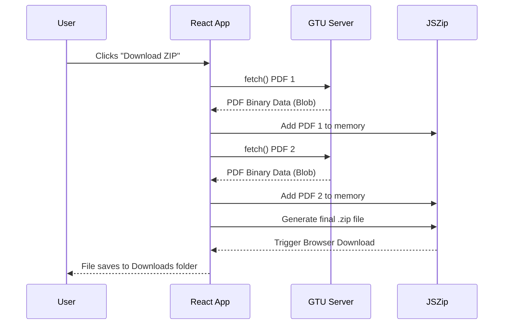

# Download Lifecycle

This document explains what happens when a user clicks "Download ZIP" after the URLs have been generated.

## Step-by-Step Flow

## How It Works in Detail

1. **State Update**:
   The frontend sets `isDownloading` to `true`, showing a spinner to the user.

2. **Fetching Loop (`pages/download.jsx`)**:
   The React app iterates through the array of candidate URLs provided by the backend.
   For each URL, it uses the native browser `fetch()` API directly against `https://gtu.ac.in`.

3. **CORS and Status Checking**:
   - **Success (200 OK)**: The paper exists! The browser downloads the binary data (`response.blob()`).
   - **Not Found (404)**: The paper wasn't found (GTU didn't conduct an exam that session, or the naming was weird). The frontend marks the paper as "failed" but continues gracefully.
   - **CORS Block**: If GTU blocks the browser from downloading across domains, `fetch` throws a TypeError. The frontend catches this and updates the UI to warn the user to use the direct links instead.

4. **In-Memory Zipping**:
   Every successfully fetched PDF blob is fed into `JSZip`. The PDFs are stored entirely in the browser's RAM.

5. **Browser Download Execution**:
   Once all URLs are checked, `JSZip` compresses the memory into a single `.zip` blob. 
   The frontend creates a hidden `<a href="...">` HTML tag, points it to the ZIP blob, and programmatically "clicks" it. The browser then handles saving the file to the user's hard drive.
