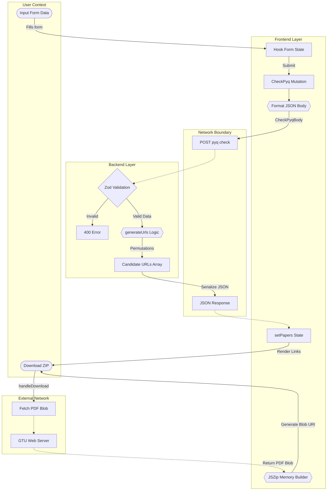
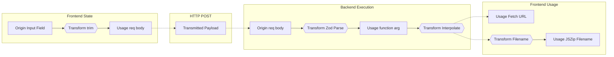
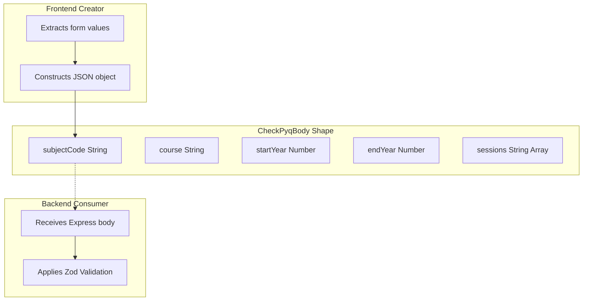
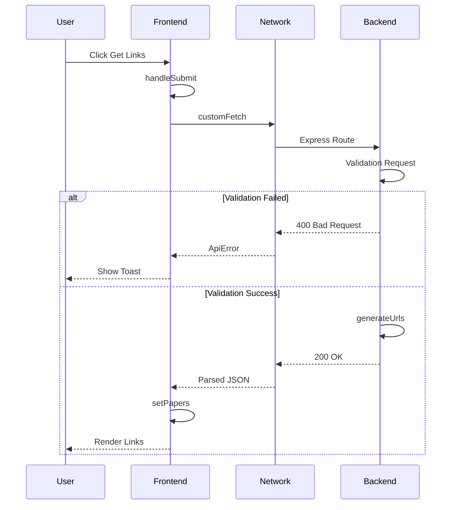
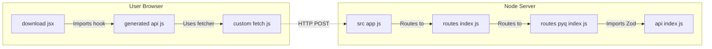
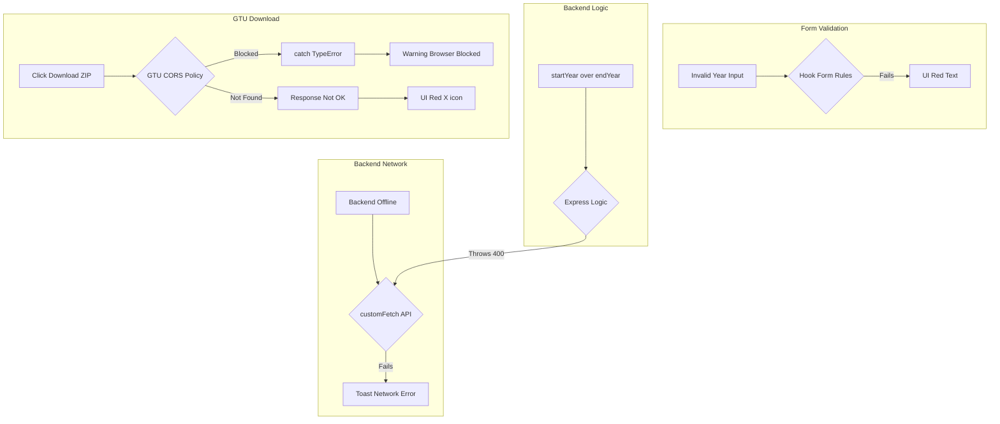

# Plain ASCII Mermaid Diagrams

These diagrams are formatted specifically for maximum compatibility with Mermaid Live Editor, Excalidraw, and other parsers. They do not contain any custom styling, HTML, or special characters inside labels.

## Data Flow Map

## Variable Trace Map

## Object Shape Map

## Function Call Map

## File Interaction Map

## Error Propagation Map

