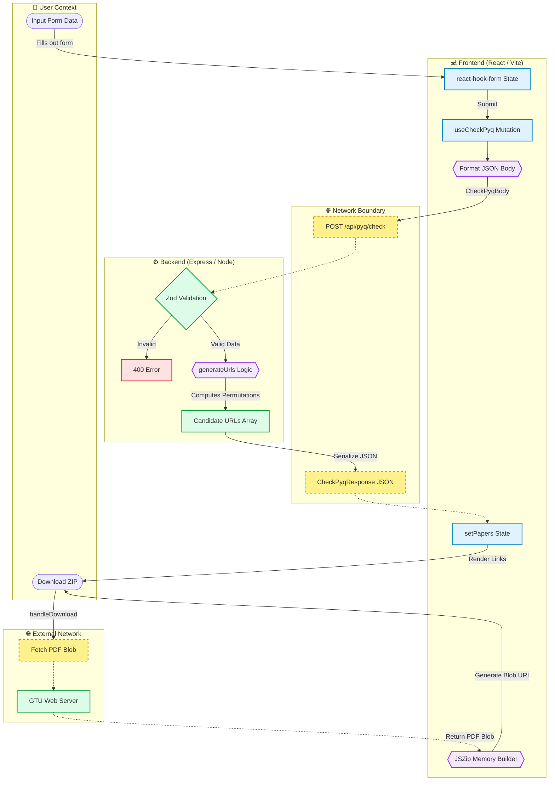
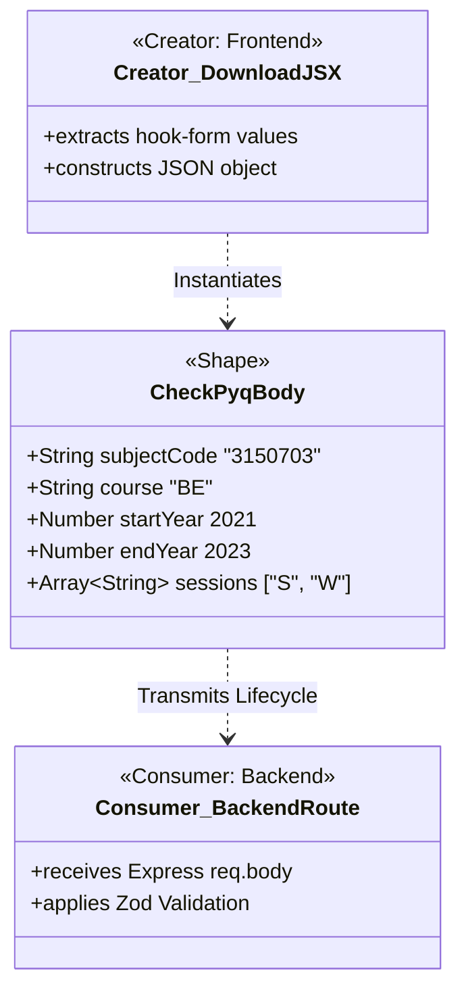
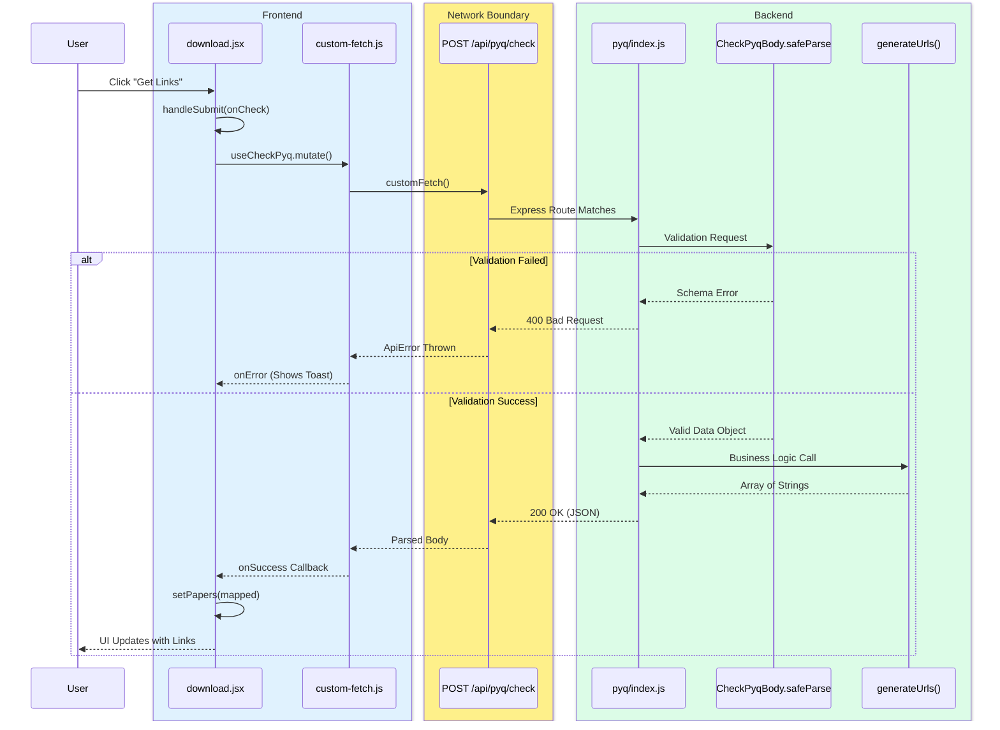
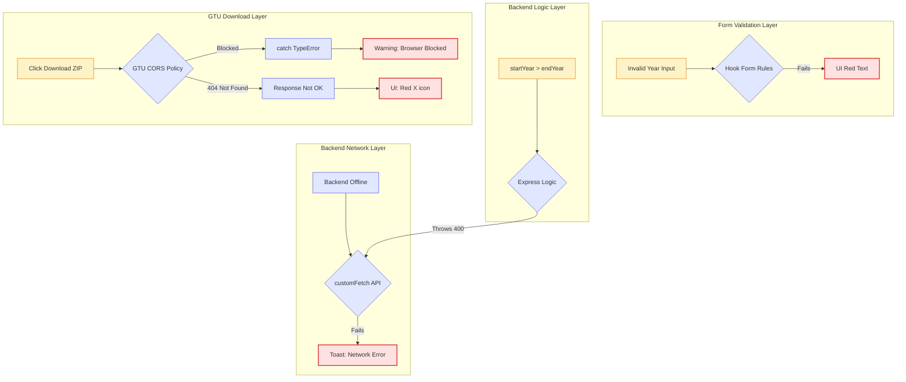

# Visual Learning Maps

These diagrams are optimized for beginners to visually trace the exact execution paths of the application. They can be copied directly into Mermaid Live, Obsidian, or GitHub.

---

## 1. Data Flow Map
*Traces the transformation of data across architectural boundaries.*



---

## 2. Variable Trace Map
*Answers: Where did this variable come from, and how did it change?*

**Variable: `subjectCode`**

```mermaid
flowchart LR
    classDef origin fill:#dbeafe,stroke:#2563eb,stroke-width:2px;
    classDef transform fill:#f3e8ff,stroke:#9333ea,stroke-width:2px;
    classDef usage fill:#dcfce7,stroke:#16a34a,stroke-width:2px;

    subgraph FrontendState ["Frontend State"]
        A[Origin: Input Field\n'3150703']:::origin --> B{{Transformation: trim()}}:::transform
        B --> C[Usage: req.body.subjectCode]:::usage
    end
    
    subgraph Network ["HTTP POST"]
        C -.-> D[Transmitted Payload]
    end

    subgraph BackendExec ["Backend Execution"]
        D -.-> E[Origin: req.body]:::origin
        E --> F{{Transformation: Zod Parse}}:::transform
        F --> G[Usage: generateUrls arg]:::usage
        G --> H{{Transformation: String Interpolation\n'.../3150703.pdf'}}:::transform
    end

    subgraph FrontendRender ["Frontend Usage"]
        H -.-> I[Usage: PDF Fetch URL]:::usage
        H -.-> J{{Transformation: makeFilename()}}:::transform
        J --> K[Usage: JSZip Filename\n'3150703_BE...pdf']:::usage
    end
```

---

## 3. Object Shape Map
*Answers: What does this object look like, who makes it, and who uses it?*



---

## 4. Function Call Map
*Answers: Who called this function, and what happens next?*



---

## 5. File Interaction Map
*Answers: Which file handles this request, and what does it import?*

```mermaid
flowchart LR
    classDef react fill:#61dafb,stroke:#000,color:#000
    classDef js fill:#f7df1e,stroke:#000,color:#000
    classDef api fill:#4caf50,stroke:#fff,color:#fff
    classDef express fill:#eeeeee,stroke:#333,color:#333

    subgraph Browser ["User Browser"]
        D[pages/download.jsx]:::react -->|Imports hook| A[api/generated/api.js]:::js
        A -->|Uses fetcher| C[api/custom-fetch.js]:::js
    end

    C -.->|HTTP POST| E[src/app.js]:::express

    subgraph Server ["Node.js Server"]
        E -->|Routes to| R1[routes/index.js]:::express
        R1 -->|Routes to| R2[routes/pyq/index.js]:::express
        R2 -->|Imports Zod| Z[api/index.js]:::api
    end
```



---

## 6. Error Propagation Map
*Answers: Where does it break, and how does the user find out?*


